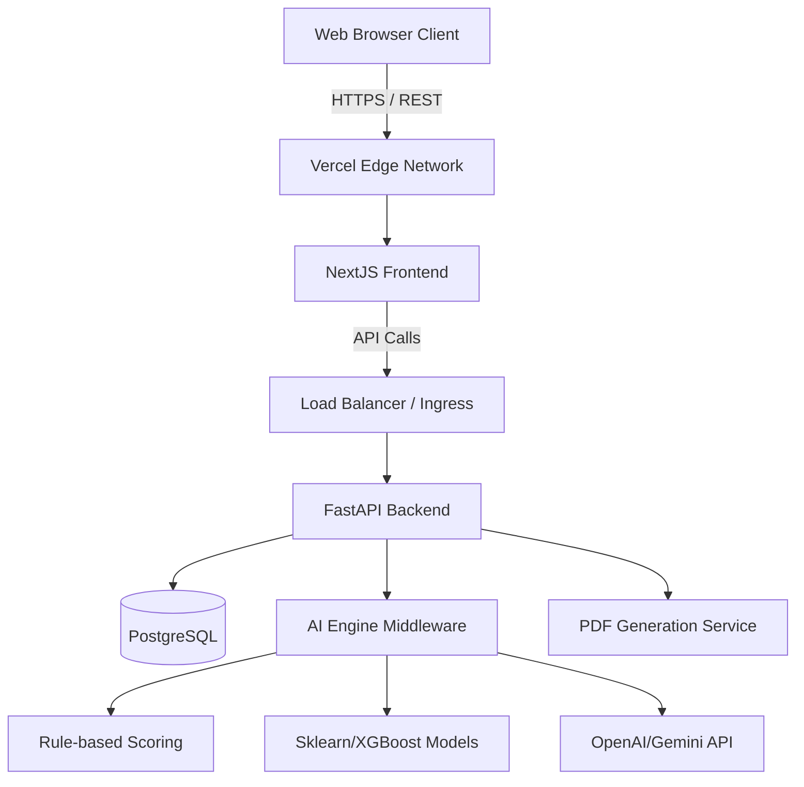

# Nexora Platform

<p align="center">
  <em>AI-powered Nuclear Infrastructure Planning and Decision Intelligence Platform.</em>
</p>

## 🌟 Overview

Nexora is a comprehensive platform designed to facilitate and accelerate the planning, assessment, and management of nuclear infrastructure for the Rosatom HackAtom. By leveraging AI-driven insights, Nexora provides stakeholders with an interactive dashboard, readiness assessments, and specialized intelligence modules for human resources, finance, and global benchmarking.

## ✨ Features

- **Readiness Assessment**: AI-powered scoring system to evaluate infrastructure readiness based on IAEA heuristics.
- **Interactive Dashboard**: Real-time analytics, timeline roadmaps, and key metrics visualizations (Gauge Charts, Radar Charts, Vertical Timelines).
- **Intelligence Modules**: 
  - **Human Resources (HR)**: Talent acquisition, training, skill gap analysis, and workforce management.
  - **Finance**: Budgeting, cost forecasting, economic modeling, and funding model recommendations.
  - **Benchmarking**: Global comparison and standards tracking using ML clustering (K-Nearest Neighbors).
  - **Stakeholder Management**: NLP Sentiment & Influence mapping.
- **Reporting**: Automated generation of comprehensive, McKinsey-style PDF roadmap reports using LLMs.

## 🏛️ System Architecture

The system follows a modern decoupled architecture:
- **Frontend Layer**: Next.js (App Router) + Tailwind CSS + Framer Motion + ChartJS/Recharts.
- **Backend API Layer**: FastAPI + Pydantic + SQLAlchemy + JWT Auth.
- **AI Processing Engine**: A hybrid engine combining Rule-based scoring, Traditional ML (Clustering for Benchmarking), and LLMs (Generative Roadmaps & Summaries).
- **Data Layer**: PostgreSQL (Relational Data) + Vector Database (Optional).



## 🧠 AI Engine & Workflows

To optimize for performance, scalability, and deterministic accuracy, the AI engine uses a **Hybrid approach**:
1. **Rule-Based Systems**: For deterministic calculations like Nuclear Readiness Score and IAEA Milestone Mapping.
2. **Machine Learning (Clustering/Regression)**: For Country Benchmarking and Workforce Prediction based on historical data.
3. **Large Language Models (Generative & Reasoning)**: For Roadmap Generation and Stakeholder Engagement Strategies.

## 🛠️ Technology Stack

- **Frontend**: Next.js 15 (App Router), React 19, Tailwind CSS v3, Framer Motion, ChartJS/Recharts, Lucide Icons.
- **Backend**: Python, FastAPI, Pydantic, SQLAlchemy, Uvicorn.
- **Database**: SQLite (Local Dev) / PostgreSQL 15 (Production).

## 🚀 Getting Started

### Prerequisites

- Node.js (v18+)
- Python (v3.9+)
- Git
- Docker (optional for deployment)

### Local Development Setup

**1. Clone the repository**
```bash
git clone https://github.com/nishnarudkar/Nexora.git
cd Nexora
```

**2. Backend Setup**
```bash
cd backend
python -m venv venv
# Activate the virtual environment
# On Windows: venv\Scripts\activate
# On macOS/Linux: source venv/bin/activate
pip install -r requirements.txt
uvicorn app.main:app --reload
```
The backend API will be available at `http://localhost:8000`.

**3. Frontend Setup**
Open a new terminal window:
```bash
cd frontend
npm install
npm run dev
```
The frontend will be available at `http://localhost:3000`.

## 🌍 Deployment Architecture

### Docker Setup
The project includes a `docker-compose.yml` for simplified deployment:
- `web`: NextJS standalone image
- `api`: FastAPI Uvicorn image
- `db`: PostgreSQL 15 Alpine image

### Backend (Render, Heroku, etc.)
1. Connect your GitHub repository to your hosting provider.
2. Set the Root Directory to `backend`.
3. Build Command: `pip install -r requirements.txt`.
4. Start Command: `uvicorn app.main:app --host 0.0.0.0 --port $PORT`.
5. Environment Variables:
   - `DATABASE_URL`: Your PostgreSQL connection string.

### Frontend (Vercel, Netlify, etc.)
1. Connect your GitHub repository to Vercel (Auto-deploys via GitHub push, Edge caching).
2. Set the Root Directory to `frontend`.
3. Environment Variables:
   - `NEXT_PUBLIC_API_URL`: The URL of your deployed backend.
4. Deploy!

## 🤝 Contributing

Contributions, issues, and feature requests are welcome! Feel free to check the [issues page](https://github.com/nishnarudkar/Nexora/issues).

## 📝 License

This project is licensed under the MIT License.
